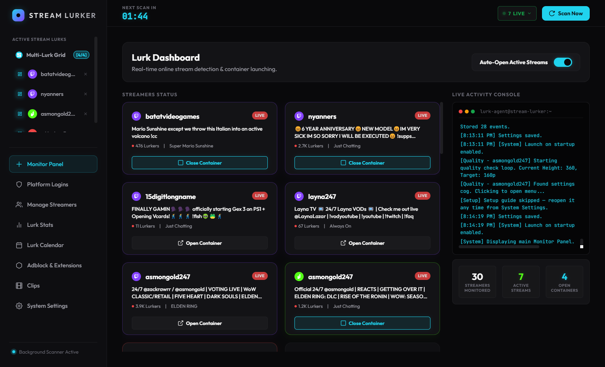
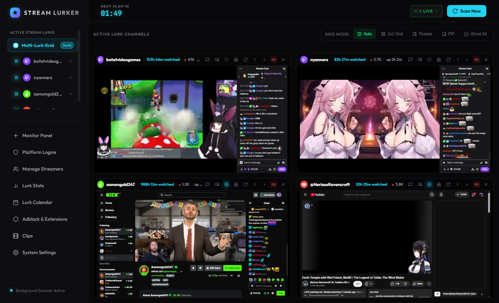
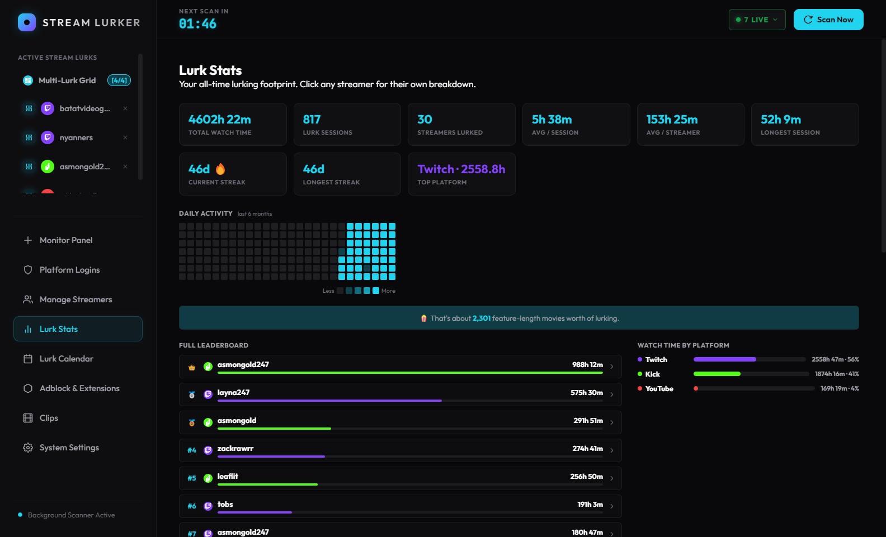
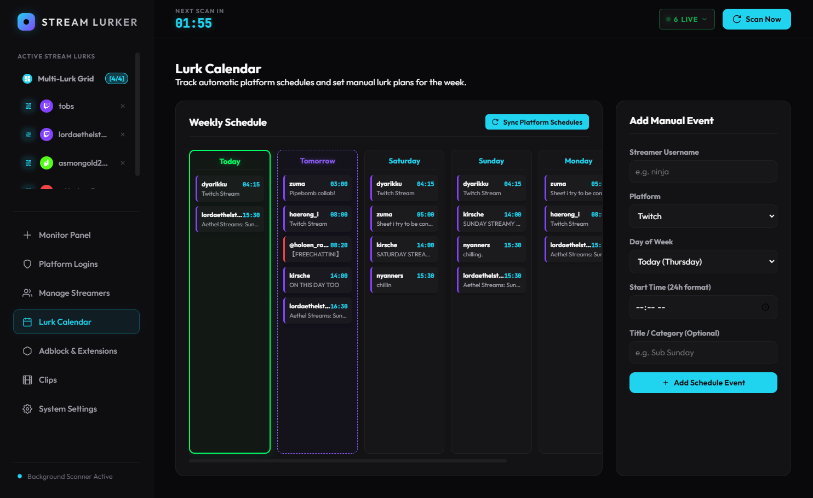
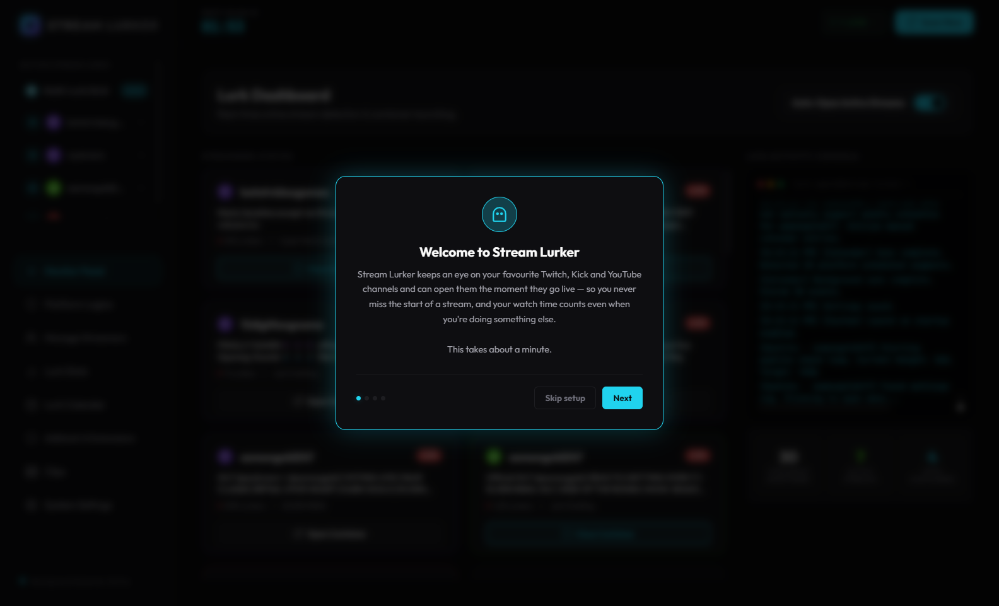

<div align="center">

# Stream Lurker

**Lurk everything. Miss nothing.**

A desktop app that monitors your favourite Twitch, Kick and YouTube channels, opens them
automatically the moment they go live, and lets you lurk a whole lineup at once in a single
low-CPU window.

[](https://github.com/Kyogrim/stream-lurker/releases/latest)
[](#license)
[](https://github.com/Kyogrim/stream-lurker/releases/latest)



</div>

## What it does

Following a lot of streamers is a chore: you miss the start of streams, you juggle a dozen
browser tabs, and each one eats a chunk of your CPU. Stream Lurker runs quietly in the
background, polls the platforms on a schedule, and takes care of it for you.

- **Never miss a go-live.** A background scanner checks every few minutes and can open a
  channel the second it starts — or just tell you about it and leave the opening to you.
- **Lurk a lineup, not a tab bar.** Streams open as muted, low-quality containers inside one
  window, so watching six channels doesn't cost six browser tabs' worth of RAM.
- **Support the streamers you follow.** Watch time is counted, and Twitch channel points are
  claimed automatically while you lurk.
- **Stay in control of your machine.** Per-stream quality caps, a Ghost Mode that suspends
  video decoding, and priority rules that decide who gets watched when limits are hit.

> **Beta.** Stream Lurker is stable in day-to-day use but still evolving —
> expect the occasional rough edge, and please open an issue if you hit one.

## Highlights

### Multi-Lurk Grid

Every live channel in one window, each with its own chat, mute, quality, reload and
Picture-in-Picture controls, and a header line showing your all-time watch time for that
streamer alongside their current viewers and uptime. Streams run muted at low quality by
default; the built-in Ghost Mode suspends decoding entirely for the ones you only want
*credited*, not watched.



### Lurk Stats

Your lurking, quantified: total watch time, sessions, streaks, longest session, a six-month
activity heatmap, the full ranking, and a per-platform split. Click any streamer for their own
breakdown — rank, share of your total, longest session, when you last watched them.



### Per-streamer alert modes

Not every channel deserves the same treatment. Each one can be set to:

| | |
|---|---|
| ⚡ **Auto-open** | Opens the stream the moment they go live |
| 🔔 **Notify only** | Tells you they're live and leaves it at that — click the alert to start watching |
| 🔕 **Ignore** | Still monitored and listed, but never alerts or opens |

### Lurk Calendar

Weekly schedules pulled straight from the platforms, plus your own manual lurk plans.



### And the rest

| | |
|---|---|
| **Live-now glance** | A top-bar pill showing who's live right now, one click to open any of them. |
| **Pop-out / PiP** | Float any single stream in an always-on-top window; the grid copy auto-suspends so nothing is decoded twice. |
| **1-click login** | A companion browser extension imports your existing sessions — no copy-pasting cookies. |
| **Adblock support** | Load unpacked Chromium extensions (uBlock Origin, 7TV, …) into the stream containers. |
| **Clips** | Browse trending clips from the streamers you monitor. |
| **Backup & transfer** | Export your streamers, history and settings to a file — or import them on another PC. |
| **Runs in the tray** | Optionally launches with Windows and starts straight to the tray, so the scanner is always going. |
| **Auto-updates** | New versions are detected and installed from within the app. |

## Install

### Download (recommended)

Grab the latest Windows installer from the [**Releases page**](https://github.com/Kyogrim/stream-lurker/releases/latest)
— run it, and the app updates itself from then on.

### Run from source

Requires [Node.js](https://nodejs.org/) (LTS).

```bash
npm install
npm start
```

Build your own distributable:

```bash
npm run dist          # Windows installer
npm run dist-linux    # Linux AppImage / tar.gz
```

## Getting started

First launch walks you through it, and you can reopen the guide any time from
**System Settings → Setup Guide**.



1. **Sign in** under **Platform Logins**. The quickest route is the 1-click **Stream Lurker
   Connector** extension — load it from the `extension/` folder via your browser's
   *Extensions → Developer mode → Load unpacked*, enter the pairing code the app shows, and
   click Connect. Pasting cookies manually also works.
2. **Add streamers** under **Manage Streamers**. Their order is the watch priority, used when
   per-platform stream limits are reached, and the button beside each one sets how it alerts you.
3. **Turn on Auto-Open** on the dashboard and leave it running. Set your default quality,
   per-platform limits and startup behaviour under **System Settings**.

## Notes

- Sessions and settings are stored locally in Electron's user-data directory
  (`%APPDATA%/stream-lurker` on Windows). Nothing is uploaded anywhere, and none of it is part
  of this repository.
- Your config — including all watch history — is written atomically and kept alongside a
  rolling backup, so an unexpected shutdown can't leave it corrupt.
- The connector extension reads cookies **only** for the platform you click, and sends them
  **only** to the app listening on `127.0.0.1` — guarded by a pairing code shown in the app.
- Rumble support is scaffolded but disabled — it's not usable yet.
- Not affiliated with Twitch, Kick, YouTube, or Rumble. Use it in line with each platform's
  terms of service.

## License

MIT
