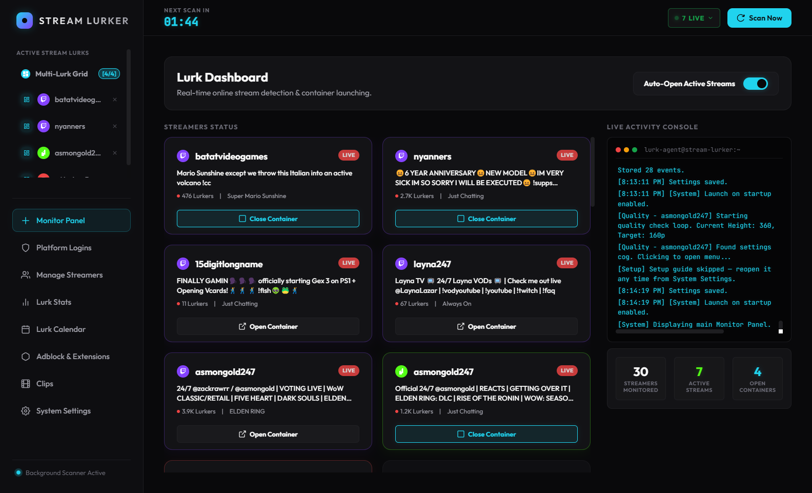
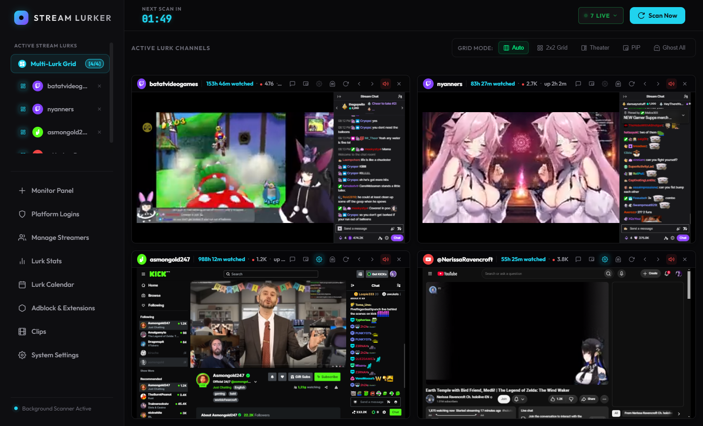
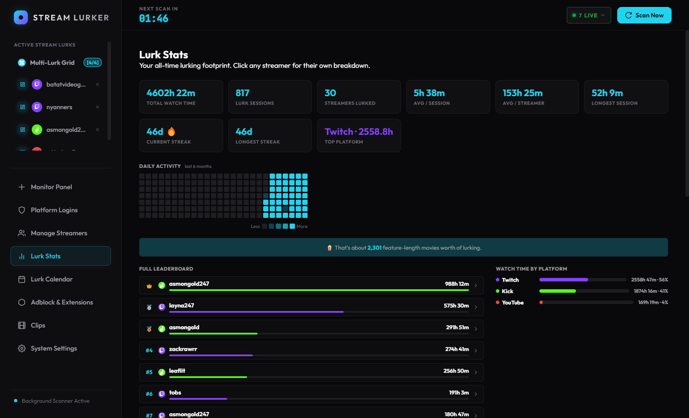
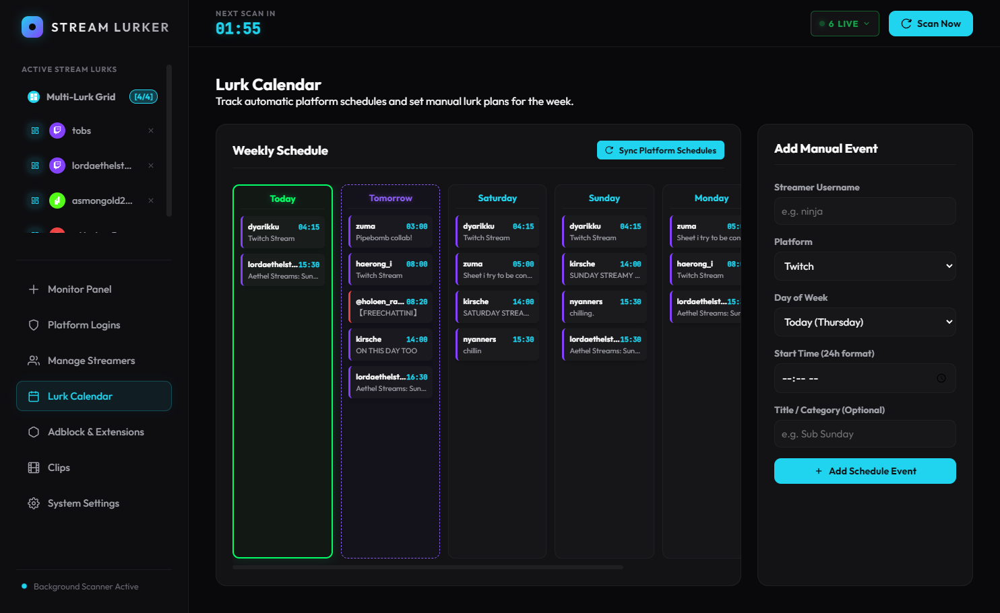
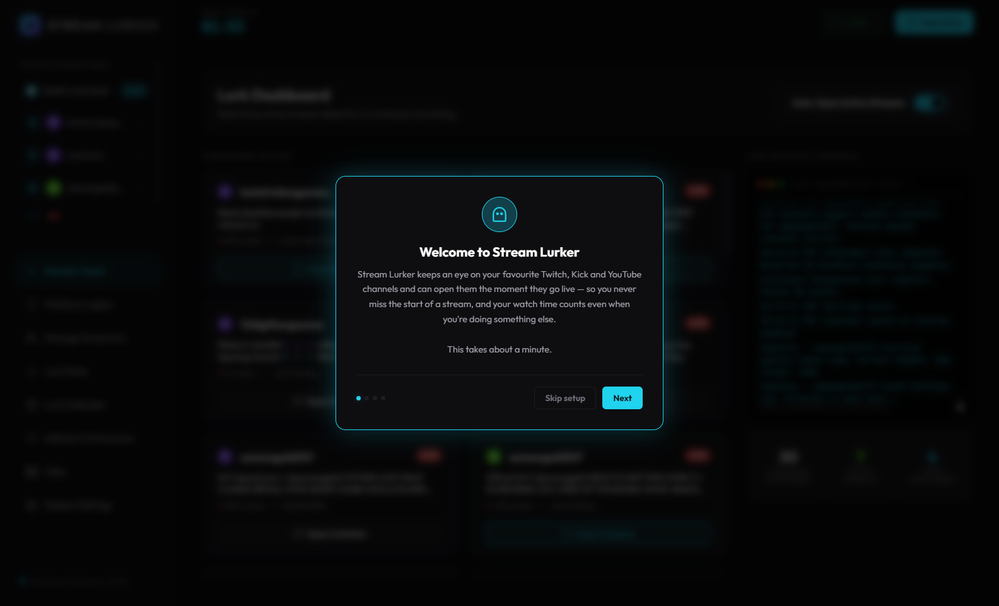

<div align="center">

# Stream Lurker

**Lurk everything. Miss nothing.**

A desktop app that monitors your favourite Twitch, Kick and YouTube channels, opens them
automatically the moment they go live, and lets you lurk a whole lineup at once in a single
low-CPU window.

[](https://github.com/Kyogrim/stream-lurker/releases/latest)
[](#license)
[](https://github.com/Kyogrim/stream-lurker/releases/latest)



</div>

## What it does

Following a lot of streamers is a chore: you miss the start of streams, you juggle a dozen
browser tabs, and each one eats a chunk of your CPU. Stream Lurker runs quietly in the
background, polls the platforms on a schedule, and takes care of it for you.

- **Never miss a go-live.** A background scanner checks every few minutes and can open a
  channel the second it starts — or just tell you about it and leave the opening to you.
- **Lurk a lineup, not a tab bar.** Streams open as muted, low-quality containers inside one
  window, so watching six channels doesn't cost six browser tabs' worth of RAM.
- **Support the streamers you follow.** Watch time is counted, and Twitch channel points are
  claimed automatically while you lurk.
- **Stay in control of your machine.** Per-stream quality caps, a Ghost Mode that suspends
  video decoding, and priority rules that decide who gets watched when limits are hit.

> **Beta.** Stream Lurker is stable in day-to-day use but still evolving —
> expect the occasional rough edge, and please open an issue if you hit one.

## Highlights

### Multi-Lurk Grid

Every live channel in one window, each with its own chat, mute, quality, reload and
Picture-in-Picture controls, and a header line showing your all-time watch time for that
streamer alongside their current viewers and uptime. Streams run muted at low quality by
default; the built-in Ghost Mode suspends decoding entirely for the ones you only want
*credited*, not watched.



### Lurk Stats

Your lurking, quantified: total watch time, sessions, streaks, longest session, a six-month
activity heatmap, the full ranking, and a per-platform split. Click any streamer for their own
breakdown — rank, share of your total, longest session, when you last watched them.



### Per-streamer alert modes

Not every channel deserves the same treatment. Each one can be set to:

| | |
|---|---|
| ⚡ **Auto-open** | Opens the stream the moment they go live |
| 🔔 **Notify only** | Tells you they're live and leaves it at that — click the alert to start watching |
| 🔕 **Ignore** | Still monitored and listed, but never alerts or opens |

### Lurk Calendar

Weekly schedules pulled straight from the platforms, plus your own manual lurk plans.



### And the rest

| | |
|---|---|
| **Live-now glance** | A top-bar pill showing who's live right now, one click to open any of them. |
| **Pop-out / PiP** | Float any single stream in an always-on-top window; the grid copy auto-suspends so nothing is decoded twice. |
| **1-click login** | A companion browser extension imports your existing sessions — no copy-pasting cookies. |
| **Browser extensions** | Load unpacked Chromium extensions (7TV, …) into the stream containers. Ad blockers load but cannot block ads here: the app's own request handling on the stream session takes precedence. |
| **Clips** | Browse trending clips from the Twitch streamers you monitor. |
| **Backup & transfer** | Export your streamers, history and settings to a file — or import them on another PC. |
| **Runs in the tray** | Optionally launches with Windows and starts straight to the tray, so the scanner is always going. |
| **In-app updates** | **System Settings → Check for Updates** finds, downloads and installs a new version when you ask. The app does not check on its own. |

## Install

### Download (recommended)

Grab the latest Windows installer from the [**Releases page**](https://github.com/Kyogrim/stream-lurker/releases/latest)
and run it.

Updates are not automatic. Now and then, open **System Settings → Check for Updates**: when a
new version is out, click **Download Update**, then **Restart & Install**. A downloaded update
also installs the next time you quit the app.

### Run from source

Requires [Node.js](https://nodejs.org/) (LTS).

```bash
npm install
npm start
```

`npm start` uses the same profile as the installed app (`%APPDATA%/stream-lurker`), so if the
installed app is running it just brings that window forward. Careful with that profile: a
source build can run a newer Electron than your installed copy, and the newer one upgrades
the login (cookie) database in a way the older one cannot read. The older version then
deletes it on its next start, which signs you out everywhere. To try a source build without
touching your real profile, quit the app, copy the profile folder, switch off `launchOnStartup`
in the copy's `config.json`, and point the build at the copy. The copy keeps your **Launch on
startup** setting, and a source build that sees it on registers `node_modules`' `electron.exe` as
your Windows sign-in entry. That entry can replace the installed app's own, so every sign-in
opens a bare Electron window instead of Stream Lurker until you start the installed app again.

```bash
# Quit the app first (tray > Quit Stream Lurker): a copy taken mid-write can be torn.
COPY="C:/path/to/profile-copy"   # <- a folder that does not exist yet
mkdir "$COPY" && cp -r "$APPDATA/stream-lurker/." "$COPY" &&
node -e "const f=process.argv[1],fs=require('fs'),c=JSON.parse(fs.readFileSync(f,'utf8'));c.launchOnStartup=false;fs.writeFileSync(f,JSON.stringify(c,null,2))" "$COPY/config.json"
npm start -- --user-data-dir="$COPY"
```

Build your own distributable:

```bash
npm run dist          # Windows installer
npm run dist-linux    # Linux AppImage / tar.gz (build from source only: untested, never published)
```

Linux is not supported yet. No release ships a Linux build, and a packaged Linux build
currently shows a blank tray icon and window icon, because `icon.png` is not bundled into it.
If its window ends up hidden in that blank tray (started minimised, or closed to the tray),
launch the app a second time to bring the window back.

## Getting started

First launch walks you through it, and you can reopen the guide any time from
**System Settings → Setup Guide**.



1. **Sign in** under **Platform Logins**. The quickest route is the 1-click **Stream Lurker
   Connector** extension — load it from the `extension/` folder via your browser's
   *Extensions → Developer mode → Load unpacked*, enter the pairing code the app shows, and
   click Connect. The extension then keeps that login fresh on its own (see Notes for exactly
   what it sends). Pasting cookies manually also works.
2. **Add streamers** under **Manage Streamers**. Their order is the watch priority, used when
   per-platform stream limits are reached, and the button beside each one sets how it alerts you.
3. **Turn on Auto-Open** on the dashboard and leave it running. Set your default quality,
   per-platform limits and startup behaviour under **System Settings**.

## Notes

- Sessions and settings are stored locally in Electron's user-data directory
  (`%APPDATA%/stream-lurker` on Windows). Nothing is uploaded anywhere, and none of it is part
  of this repository.
- Your config — including all watch history — is written atomically and kept alongside a
  rolling backup, so an unexpected shutdown can't leave it corrupt.
- The connector extension reads a platform's cookies in your browser when you click
  **Connect** for it. After that it re-reads and re-sends them by itself about every 30
  minutes, for the platforms you connected and only while its pairing code is filled in,
  because Google keeps rotating its sign-in tokens and a one-time copy goes stale.
  - **What it sends.** Twitch: `twitch.tv` cookies. Kick: `kick.com` cookies. YouTube:
    `youtube.com` cookies, plus the ones set for `google.com` and `accounts.google.com`
    themselves. Those Google cookies are your Google account sign-in, not just YouTube's.
    Cookies of other Google sites (`mail.google.com`, `docs.google.com`, …) are filtered out
    and never sent, and the app drops anything outside this list on its side too.
  - **Where it sends them.** Only to `127.0.0.1`, never over the network, and only to a
    listener that first proves it knows your pairing code: the extension sends a random
    challenge and checks the answer before it sends anything. The app refuses imports with the
    wrong code (after five wrong codes in a row it refuses every import for a minute) and
    refuses requests that come from web pages.
  - **Signing out.** Sign a platform out in Stream Lurker, or connect it from inside the app
    instead, and the app turns down the extension's automatic re-sync for it; the extension
    then stops syncing that platform and its popup says so. Clicking **Connect** for it in the
    extension turns syncing back on.
  - **Stopping it.** Click **Stop** next to a platform in the popup's Auto-sync list, clear
    the pairing code to pause all syncing, or remove the extension. **New code** in Platform
    Logins makes the app reject the code the extension has saved.
- Rumble support is scaffolded but disabled — it's not usable yet.
- Not affiliated with Twitch, Kick, YouTube, or Rumble. Use it in line with each platform's
  terms of service.

## License

MIT
